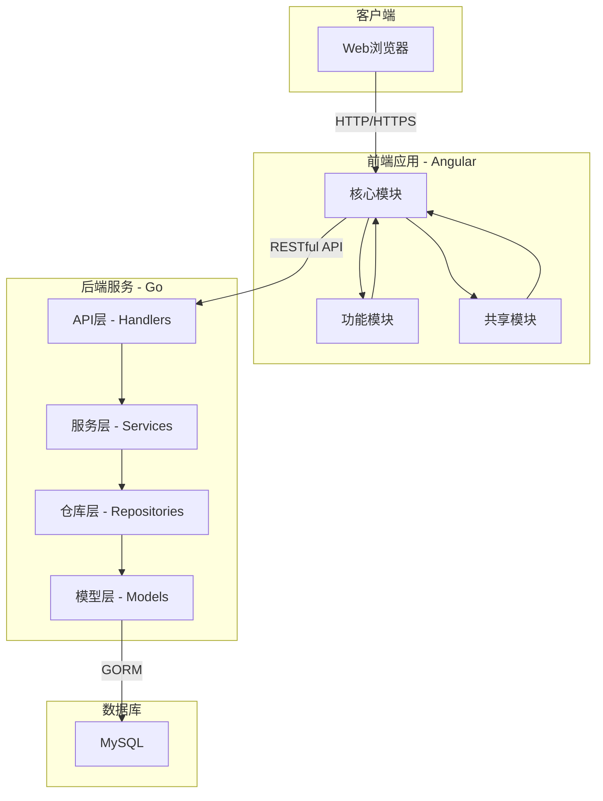
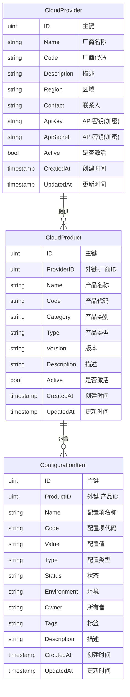

# CloudEye - 多云资源配置管理平台

## 项目简介

CloudEye是一个专为企业级用户设计的多云资源配置管理平台，旨在解决企业在多云环境下资源配置管理复杂、分散且难以追踪的问题。通过CloudEye，IT管理员可以统一管理、监控和优化分布在不同云服务提供商的资源配置，从而提高云资源使用效率，降低管理成本和运维风险。

### 主要价值

- **集中管理**：统一管理来自多个云服务商的资源配置
- **可视化**：通过直观的仪表盘展示资源分布和使用情况
- **标准化**：建立资源配置的标准化流程
- **优化成本**：识别未使用或低效使用的资源，优化云成本
- **合规性**：确保资源配置符合企业安全和合规要求

### 目标用户

- 企业IT管理员和云架构师
- 多云环境下的DevOps团队
- 需要管理大量云资源的中大型企业

## 系统架构

CloudEye采用现代化的前后端分离架构，确保系统的可扩展性、可维护性和性能。



### 技术栈

#### 后端
- **语言**：Go 1.18+
- **Web框架**：Gin
- **ORM**：GORM
- **数据库**：MySQL 8.0+

#### 前端
- **框架**：Angular 15+
- **UI组件库**：Angular Material
- **HTTP客户端**：Angular HttpClient
- **状态管理**：RxJS

#### 部署
- **容器化**：Docker & Docker Compose
- **Web服务器**：Nginx (生产环境)

## 核心功能特性

### 云厂商管理

- 支持主流云服务提供商（AWS、阿里云、腾讯云、Azure等）
- 云厂商信息管理（添加、编辑、删除、查询）
- 厂商资源统计与分析

**主要操作流程**：
1. 添加云服务提供商基础信息
2. 配置云服务提供商认证信息（可选）
3. 查看云服务提供商下资源统计

### 云产品管理

- 管理各云厂商提供的产品服务
- 产品分类与标签管理
- 产品信息检索与筛选

**主要操作流程**：
1. 选择云服务提供商
2. 添加/导入云产品信息
3. 配置产品分类与标签
4. 关联产品与配置项

### 配置项管理

- 配置项的创建、读取、更新、删除（CRUD）
- 高级搜索与筛选功能
- 配置项标签与分类管理
- 配置项版本控制与历史追踪

**主要操作流程**：
1. 创建新配置项（选择云厂商和产品）
2. 设置配置项属性和参数
3. 添加标签和描述信息
4. 保存并发布配置项

### 数据导入导出

- 支持Excel格式的批量导入导出
- 导入验证与错误报告
- 导出数据自定义与格式控制

**主要操作流程**：
1. 选择导入/导出功能
2. 对于导入：上传Excel文件，系统验证并导入数据
3. 对于导出：选择导出字段和格式，系统生成Excel文件

### 统计分析仪表盘

- 资源分布可视化展示
- 按云厂商、产品类型统计
- 资源使用趋势分析
- 自定义报表生成

**主要操作流程**：
1. 访问仪表盘页面
2. 查看预设统计图表
3. 根据需要设置筛选条件
4. 导出统计报表（可选）

## 数据模型说明

CloudEye系统核心围绕三个主要实体进行设计：云服务商、云产品和配置项。



### 实体说明

#### 云服务商 (CloudProvider)
云服务商代表如AWS、阿里云、腾讯云等云服务提供商，存储其基本信息和API访问凭证。

#### 云产品 (CloudProduct)
云产品代表云服务商提供的具体产品或服务，如EC2、RDS、OSS等，与云服务商关联。

#### 配置项 (ConfigurationItem)
配置项是系统的核心实体，代表具体的云资源配置，与特定的云产品关联。

## API文档

CloudEye提供RESTful API，支持所有核心功能的远程访问和集成。

### 云服务商API

#### 获取所有云服务商
```
GET /api/v1/providers
```
**响应示例**：
```json
{
  "code": 200,
  "data": [
    {
      "id": 1,
      "name": "阿里云",
      "code": "aliyun",
      "description": "阿里云服务",
      "region": "cn-hangzhou",
      "active": true,
      "created_at": "2023-01-01T00:00:00Z",
      "updated_at": "2023-01-01T00:00:00Z"
    }
  ],
  "message": "success"
}
```

#### 获取特定云服务商
```
GET /api/v1/providers/:id
```

#### 创建云服务商
```
POST /api/v1/providers
```
**请求体示例**：
```json
{
  "name": "腾讯云",
  "code": "tencent",
  "description": "腾讯云服务",
  "region": "ap-guangzhou",
  "active": true
}
```

#### 更新云服务商
```
PUT /api/v1/providers/:id
```

#### 删除云服务商
```
DELETE /api/v1/providers/:id
```

### 云产品API

#### 获取所有云产品
```
GET /api/v1/products
```

#### 获取特定云产品
```
GET /api/v1/products/:id
```

#### 创建云产品
```
POST /api/v1/products
```
**请求体示例**：
```json
{
  "provider_id": 1,
  "name": "云服务器",
  "code": "ecs",
  "category": "计算",
  "type": "虚拟机",
  "version": "1.0",
  "description": "弹性计算服务",
  "active": true
}
```

#### 更新云产品
```
PUT /api/v1/products/:id
```

#### 删除云产品
```
DELETE /api/v1/products/:id
```

### 配置项API

#### 获取所有配置项
```
GET /api/v1/items
```

#### 获取特定配置项
```
GET /api/v1/items/:id
```

#### 创建配置项
```
POST /api/v1/items
```
**请求体示例**：
```json
{
  "product_id": 1,
  "name": "生产环境ECS实例",
  "code": "prod-ecs-001",
  "value": "m5.large",
  "type": "instance",
  "status": "active",
  "environment": "production",
  "owner": "系统运维组",
  "tags": "生产,核心业务",
  "description": "生产环境核心业务ECS实例"
}
```

#### 更新配置项
```
PUT /api/v1/items/:id
```

#### 删除配置项
```
DELETE /api/v1/items/:id
```

### 导入导出API

#### 导出配置项
```
GET /api/v1/export
```

#### 导入配置项
```
POST /api/v1/import
```

## 环境设置与部署指南

### 系统要求

- **操作系统**：Linux, macOS, 或 Windows
- **Docker**：20.10.x+
- **Docker Compose**：2.x+
- **Git**：2.x+

对于非Docker部署，还需要：
- **Go**：1.18+
- **Node.js**：16.x+
- **npm**：8.x+
- **MySQL**：8.0+

### 快速开始（Docker）

#### 克隆仓库
```bash
git clone https://github.com/your-org/cloudeye.git
cd cloudeye
```

#### 使用Docker Compose启动
```bash
docker-compose up -d
```

系统将在以下地址可用：
- **前端**：http://localhost:80
- **后端API**：http://localhost:8080

### 本地开发环境设置

#### 后端设置

1. 设置Go环境
```bash
cd cloudeye
go mod download
```

2. 准备配置文件
```bash
cp configs/config.yaml.example configs/config.yaml
# 编辑配置文件，设置数据库连接等
```

3. 运行后端
```bash
go run main.go
```

#### 前端设置

1. 安装依赖
```bash
cd frontend
npm install
```

2. 配置环境
```bash
# 根据需要编辑 src/environments/environment.ts
```

3. 运行开发服务器
```bash
npm start
```

#### 数据库设置

1. 创建MySQL数据库
```sql
CREATE DATABASE cloudeye CHARACTER SET utf8mb4 COLLATE utf8mb4_unicode_ci;
```

2. 初始化数据库
```bash
mysql -u username -p cloudeye < init_database.sql
```

### 生产环境部署

#### 系统要求
- **服务器**：2核4G内存以上
- **存储**：20GB以上
- **网络**：公网IP或内网环境

#### Docker部署步骤

1. 准备配置文件
```bash
cp configs/config.yaml.example configs/config.production.yaml
# 编辑生产环境配置
```

2. 构建生产镜像
```bash
docker-compose -f docker-compose.production.yml build
```

3. 启动服务
```bash
docker-compose -f docker-compose.production.yml up -d
```

#### 安全考虑

- 在生产环境中使用HTTPS
- 使用非root用户运行容器
- 定期更新依赖和系统
- 设置适当的数据库备份策略
- 保护API密钥和敏感信息

## 使用指南

### 初始化系统

1. 确保系统已成功部署和启动
2. 使用默认管理员账户登录（在首次部署时自动创建）
   - 用户名：admin@example.com
   - 密码：Admin123
3. 首次登录后立即修改默认密码

### 基本操作流程

#### 配置云服务商
1. 导航至"云服务商"页面
2. 点击"添加服务商"按钮
3. 填写必要信息（名称、代码、区域等）
4. 提交表单，创建云服务商

#### 添加云产品
1. 导航至"云产品"页面
2. 点击"添加产品"按钮
3. 选择云服务商，填写产品详情
4. 提交表单，创建云产品

#### 管理配置项
1. 导航至"配置项"页面
2. 创建新配置项或编辑现有配置项
3. 设置配置项的详细参数
4. 保存更改

#### 导入导出数据
1. 导航至"导入/导出"页面
2. 选择操作类型（导入或导出）
3. 对于导入：上传Excel文件
4. 对于导出：选择导出范围，下载生成的Excel文件

#### 查看统计数据
1. 导航至"仪表盘"页面
2. 浏览预设报表和统计图表
3. 根据需要设置日期范围和筛选条件
4. 导出报表（如需要）

## 常见问题(FAQ)

### 系统相关

#### Q: 如何重置管理员密码？
A: 目前系统不提供自助密码重置功能。请联系系统管理员通过数据库直接更新密码。

#### Q: 系统支持哪些浏览器？
A: CloudEye支持所有现代浏览器，包括Chrome、Firefox、Safari和Edge的最新版本。推荐使用Chrome获得最佳体验。

#### Q: 如何备份系统数据？
A: 系统数据存储在MySQL数据库中，建议使用标准的MySQL备份工具（如mysqldump）定期备份数据。

### 技术相关

#### Q: API请求返回500错误怎么办？
A: 检查以下几点：
1. 查看服务器日志（`docker logs cloudeye-backend`）
2. 确认数据库连接正常
3. 验证请求参数格式是否正确

#### Q: 前端加载缓慢如何解决？
A: 尝试以下解决方案：
1. 清除浏览器缓存
2. 检查网络连接
3. 如果使用的是开发环境，可能是因为构建优化未启用

#### Q: Docker容器无法启动怎么办？
A: 检查以下几点：
1. 查看Docker日志：`docker-compose logs`
2. 确认配置文件中的端口未被占用
3. 验证所有必要的环境变量已正确设置

### 功能相关

#### Q: 如何批量导入配置项？
A: 使用Excel导入功能：
1. 导航至"导入/导出"页面
2. 下载模板文件
3. 填写配置项数据
4. 上传填写完成的Excel文件

#### Q: 如何添加新的云服务提供商？
A: 系统预设了主流云服务提供商。如需添加自定义提供商：
1. 导航至"云服务商"页面
2. 点击"添加"按钮
3. 填写提供商详情并保存

## 贡献指南

### 贡献流程

1. Fork项目仓库
2. 创建功能分支 (`git checkout -b feature/amazing-feature`)
3. 提交更改 (`git commit -m 'Add amazing feature'`)
4. 推送到分支 (`git push origin feature/amazing-feature`)
5. 创建Pull Request

### 开发规范

- **Go代码**：遵循[Effective Go](https://golang.org/doc/effective_go)规范
- **Angular代码**：遵循[Angular风格指南](https://angular.io/guide/styleguide)
- **提交信息**：使用清晰的提交信息，遵循[约定式提交](https://www.conventionalcommits.org/)
- **文档**：更新相关文档以反映代码变更

### 问题报告

如果您发现bug或有功能建议，请提交issue，并包含以下信息：

- 问题的详细描述
- 复现步骤（对于bug）
- 预期行为vs实际行为
- 截图（如适用）
- 环境信息（浏览器、操作系统等）

## 版本历史与开发路线图

### 版本历史

- **v1.0.0** (2023-05-01)：初始版本发布
  - 基本的云服务商、云产品和配置项管理
  - Excel导入导出
  - 简单仪表盘

### 开发路线图

#### 近期计划 (2023 Q3-Q4)
- 完善认证和授权机制
- 增强数据可视化能力
- 添加资源成本分析功能
- 改进用户界面体验

#### 中期计划 (2024 Q1-Q2)
- 集成云服务API，实现配置自动同步
- 添加资源变更审计功能
- 支持更多云服务提供商
- 实现配置模板和批量操作

#### 长期计划
- 开发资源自动发现功能
- 实现配置合规性检查
- 添加自动化工作流
- 构建开放API和集成生态系统

---

© 2023 CloudEye项目组。保留所有权利。